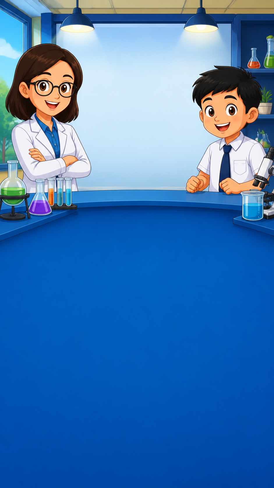
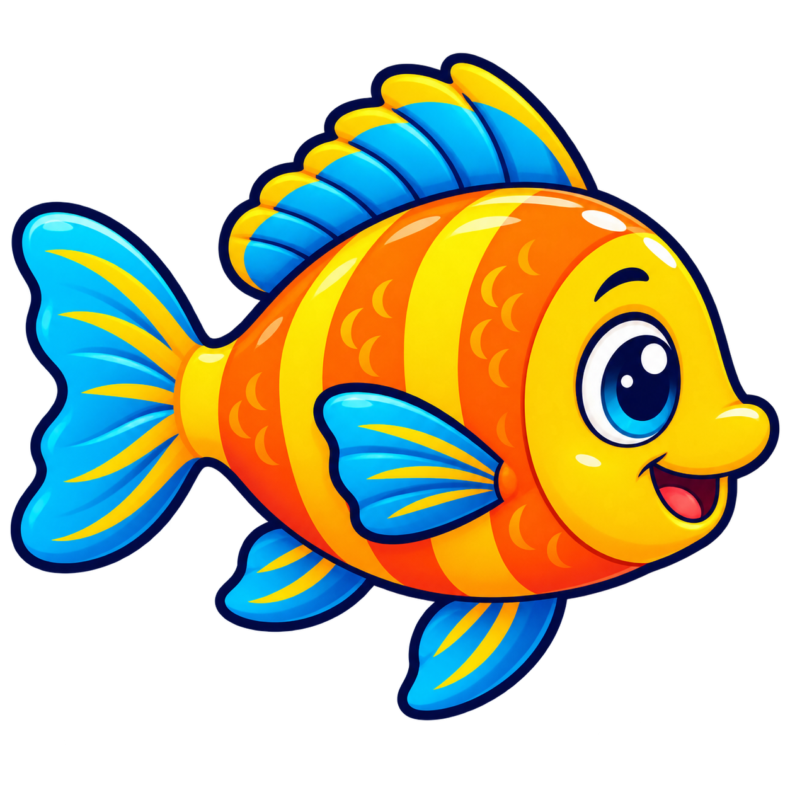
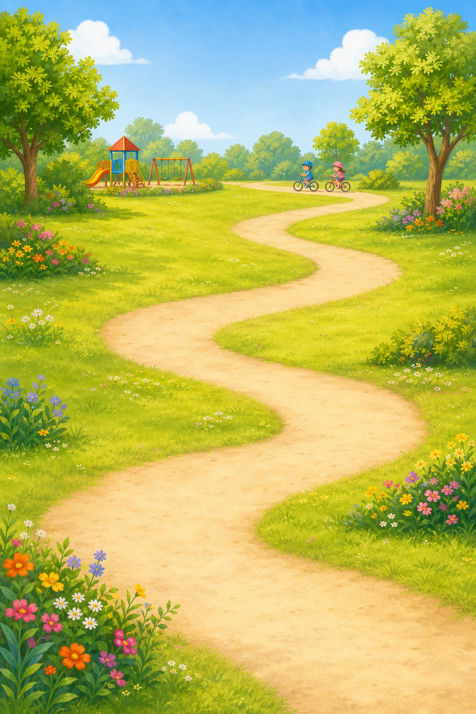

# Literasi Game Creation and Update Guide

This document is the working reference for adding, updating, and maintaining Literasi React games while keeping the existing Unity games available.

## 1. Current games

| Activity | Technology | Direct URL | Main source |
|---|---|---|---|
| Literasi Drag & Drop | React | `/demo/literasi-web` | `resources/js/Pages/Demos/LiterasiWebGame/Index.jsx` |
| Literasi Huruf A–Z | React | `/demo/literasi-huruf` | `resources/js/Pages/Demos/AlphabetTraceGame/Index.jsx` |
| Literasi 1–10 | Unity WebGL | Database/S3 | `interactive_games.launch_url` |

React and Unity activities are displayed together on the subject Interactive page. Do not replace or delete a Unity record when adding a React activity.

## 2. Recommended isolated structure

Keep the reusable game engine separate from subject and standard content.

```text
resources/js/Games/Literasi/
├── shared/
│   ├── components/
│   │   ├── ProgressBar.jsx
│   │   ├── SoundButton.jsx
│   │   └── CompletionScreen.jsx
│   └── utils/
│       ├── speech.js
│       └── scoring.js
├── DragDrop/
│   ├── Index.jsx
│   ├── styles.css
│   └── data/
│       ├── bahasa-malaysia/
│       │   ├── standard1.js
│       │   ├── standard2.js
│       │   └── standard3.js
│       ├── english/
│       │   ├── standard1.js
│       │   ├── standard2.js
│       │   └── standard3.js
│       ├── mathematics/
│       │   ├── standard1.js
│       │   ├── standard2.js
│       │   └── standard3.js
│       └── science/
│           ├── standard1.js
│           ├── standard2.js
│           └── standard3.js
└── AlphabetTrace/
    ├── Index.jsx
    ├── styles.css
    └── data/
        └── bahasa-malaysia/
            ├── standard1.js
            ├── standard2.js
            └── standard3.js
```

Use the same isolation for artwork:

```text
public/images/literasi/
├── drag-drop/
│   ├── bahasa-malaysia/
│   │   ├── standard-1/
│   │   ├── standard-2/
│   │   └── standard-3/
│   ├── english/
│   ├── mathematics/
│   └── science/
│       └── standard-2/
│           ├── background.png
│           ├── background-mobile.png
│           └── objects/
│               ├── fish.png
│               ├── ice.png
│               └── plant.png
└── alphabet-trace/
    └── bahasa-malaysia/
        └── standard-1/
            └── background.png
```

## 3. Standard question file format

Each subject and standard should export one configuration object. Keep five questions in each session unless the product requirement changes.

```js
export default {
    subject: 'science',
    standard: 2,
    title: 'Science Drag & Drop',
    instruction: 'Drag the best answer here',
    background: '/images/literasi/drag-drop/science/standard-2/background.png',
    mobileBackground: '/images/literasi/drag-drop/science/standard-2/background-mobile.png',
    questions: [
        {
            id: 'science-s2-q1',
            question: 'Fish live in…',
            answer: 'water',
            options: ['water', 'a tree', 'the sky'],
            image: '/images/literasi/drag-drop/science/standard-2/objects/fish.png',
            imageAlt: 'A colourful fish',
        },
    ],
};
```

Rules:

- Give every question a stable unique `id`.
- The correct `answer` must exactly match one entry in `options`.
- Use exactly three options for the current drag-and-drop design.
- Add useful `imageAlt` text for accessibility.
- Keep question text short enough to fit on two lines.
- Do not store presentation CSS inside a question file.

## 4. Adding a new question set

1. Choose the game, subject, and standard.
2. Create the new subject/standard data file.
3. Add five validated questions.
4. Generate one landscape background and one portrait mobile background.
5. Generate separate transparent PNGs for question objects.
6. Add the dataset to the game registry.
7. Open the direct route and test all five answers.
8. Test voice, drag/drop, progress, completion, mobile, tablet, and desktop layouts.
9. Run `npm run build`.

## 5. Adding a completely new React Literasi game

1. Create a dedicated game folder containing `Index.jsx` and its CSS file.
2. Add a Laravel route in `routes/web.php`.
3. Add a separate React activity entry in `InteractiveController`.
4. Use a unique activity `id`, `slug`, title, and launch URL.
5. Keep `type: 'react_literasi'` so the shared modal labels it correctly.
6. Do not change existing Unity activity mappings.

Example activity entry:

```php
$interactiveModules->prepend([
    'id' => "react-example-{$selectedLevel->id}-{$subjectData->id}",
    'slug' => 'literasi-example-react',
    'title' => 'Literasi Example',
    'description' => 'Description of the new activity.',
    'type' => 'react_literasi',
    'standard' => strtoupper($selectedLevel->name),
    'form' => $selectedLevel->name,
    'status' => 'available',
    'icon' => 'gamepad',
    'order' => -2,
    'launch_url' => route('demo.literasi-example', ['embedded' => 1]),
    'thumbnail_url' => null,
]);
```

## 6. Landscape background generation prompt

Replace all text inside square brackets.

```text
Use case: children’s educational game background

Create a polished 2D cartoon background for a Malaysian primary-school Literasi game.

Subject: [SUBJECT]
Standard: [STANDARD]
Scene: [SCENE DESCRIPTION]

Characters:
- One friendly teacher positioned in the upper-left area
- One happy primary-school student positioned in the upper-right area
- Characters should be relatively small and occupy no more than 38% of the image height

Composition:
- Wide landscape 16:9 format
- Resolution: 2048 × 1152
- Keep a large clean central area in the upper half for a question speech bubble
- Reserve approximately the lower 45–48% as a clean blue game panel
- Use a gentle curved boundary between the illustrated scene and blue panel
- Use only a very subtle dot or star texture in the lower panel
- Keep important characters and objects away from the edges
- Make the composition safe for web and tablet cropping

Style:
- Bright friendly children’s educational-game illustration
- Smooth polished 2D cartoon rendering
- Rounded shapes and expressive characters
- Thick clean outlines
- Cheerful Malaysian primary-school atmosphere
- Consistent blue, cyan, yellow and coral colour palette

Constraints:
- Background artwork only
- No text, letters, numbers, speech bubbles or UI
- No answer boxes, progress bars, buttons or score indicators
- No logos or watermark
- No detailed objects in the lower blue panel
- Do not crop faces, heads or hands
```

## 7. Mobile background generation prompt

Generate this as a second matched asset. Do not crop the landscape image and expect identical results.

```text
Create a portrait mobile version of the same children’s educational game background.

Subject: [SUBJECT]
Standard: [STANDARD]
Scene: [SCENE DESCRIPTION]

Format:
- Portrait 9:16
- Resolution: 1152 × 2048
- Preserve the teacher, student, clothing, expressions, environment, lighting and illustration style from the landscape reference

Composition:
- Teacher in the upper-left and student in the upper-right
- Characters fit completely within the upper 32–36%
- Clear space between them for the question box
- Lower 60–65% is a clean blue game panel
- Soft curved boundary above the blue panel
- Keep important content in the centre-safe area

Constraints:
- Background artwork only
- No text, letters, numbers or UI
- No answer cards or buttons
- No logo or watermark
- Do not crop faces or hands
```

## 8. Transparent object PNG prompt

```text
Use case: children’s educational game object

Create one [OBJECT] as a transparent PNG illustration for a Standard [STANDARD] [SUBJECT] game.

Style:
- Polished colourful 2D children’s educational-game illustration
- Friendly rounded appearance
- Thick dark-navy outline
- Soft highlights and gentle shading
- Match the existing Literasi game artwork

Composition:
- One object only
- Object centred and completely visible
- Square canvas with generous transparent space
- Clear and recognisable at 100–160 pixels

Technical requirements:
- Genuinely transparent background with preserved alpha
- Crisp clean edges
- No white rectangle behind the object
- No text, letters, numbers, people or scenery
- No frame, badge, logo or watermark
```

## 9. Prompt replacement example

```text
[SUBJECT] = Science
[STANDARD] = Standard 2
[SCENE DESCRIPTION] = A bright blue science laboratory with shelves, a microscope, colourful test tubes and laboratory glassware
[OBJECT] = A friendly orange tropical fish with blue fins
```

## 10. Visual output examples

### Landscape game background

This demonstrates small characters in the upper scene, a clear question area, and a large blue control-safe region below.


### Mobile game background

This demonstrates a portrait composition with the illustrated scene above and a large safe area for controls below.



### Transparent question object

This demonstrates a centred, outlined object with a true transparent background.



### Alphabet-game background

This demonstrates calm scenery that can accept many React letter tiles without reducing readability.



## 11. Final verification checklist

- [ ] Correct subject and standard data file is loaded.
- [ ] Session contains the intended five questions.
- [ ] Correct answer exists in the options.
- [ ] Landscape and mobile backgrounds load without 404 errors.
- [ ] Object PNGs have transparent backgrounds.
- [ ] Question and answers remain readable at mobile, tablet, and desktop widths.
- [ ] Drag/drop or click interaction works with touch and mouse.
- [ ] Voice starts only after a user interaction.
- [ ] Progress and score update correctly.
- [ ] Completion screen appears.
- [ ] React and Unity cards are both still present.
- [ ] Direct route works.
- [ ] Modal route works.
- [ ] `npm run build` completes successfully.

## 12. Current files that control integration

- React/Unity module list: `app/Http/Controllers/Web/InteractiveController.php`
- Shared activity modal: `resources/js/Pages/courses/SubjectInteractivePage.jsx`
- Activity card presentation: `resources/js/Pages/courses/interactive/StandardModules.jsx`
- Demo routes: `routes/web.php`
- Unity database setup: `database/seeders/InteractiveGameSeeder.php`
